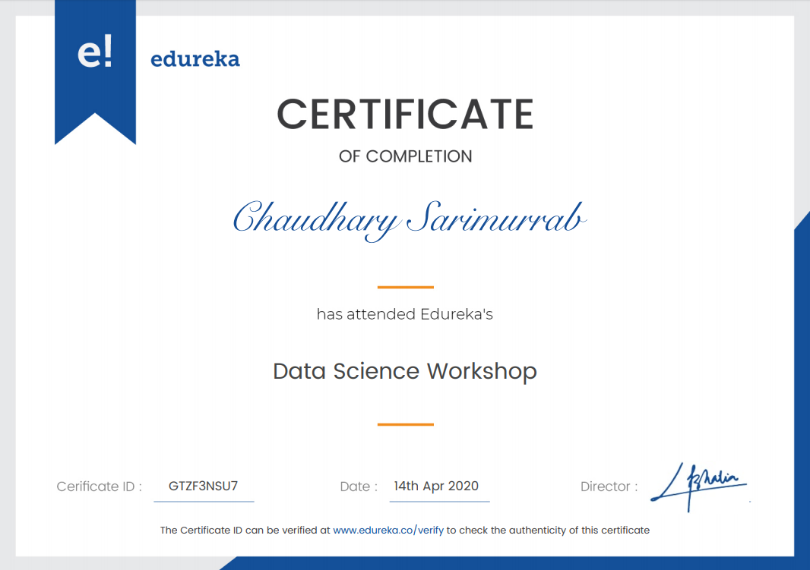

# Prediction-of-PUBG-winner
This project  is being created in a Data Science Workshop from Edureka.
And this is a kaggle challenge.
# [PUBG KAGGLE CHALLENGE](https://www.kaggle.com/c/pubg-finish-placement-prediction/overview)

# [Assignment Completion](https://www.edureka.co/lms/certificate/881432d6ec819716d14fd0fd6df0b1f7) <-- Verify

